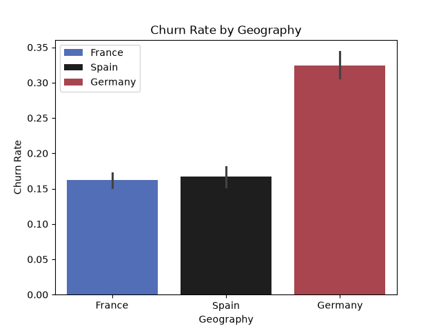
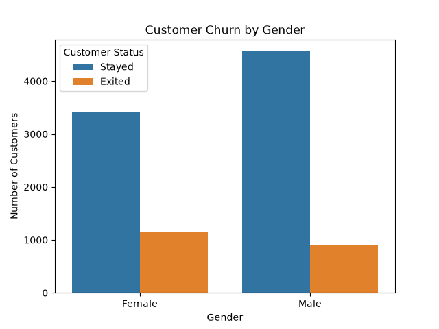
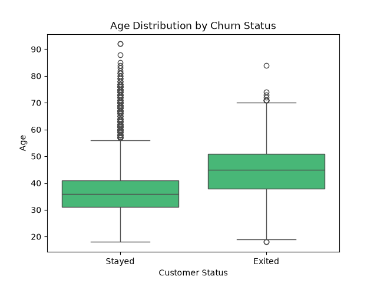
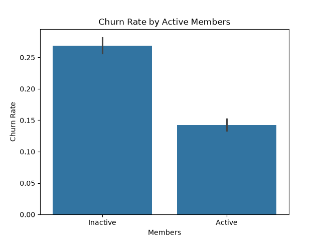
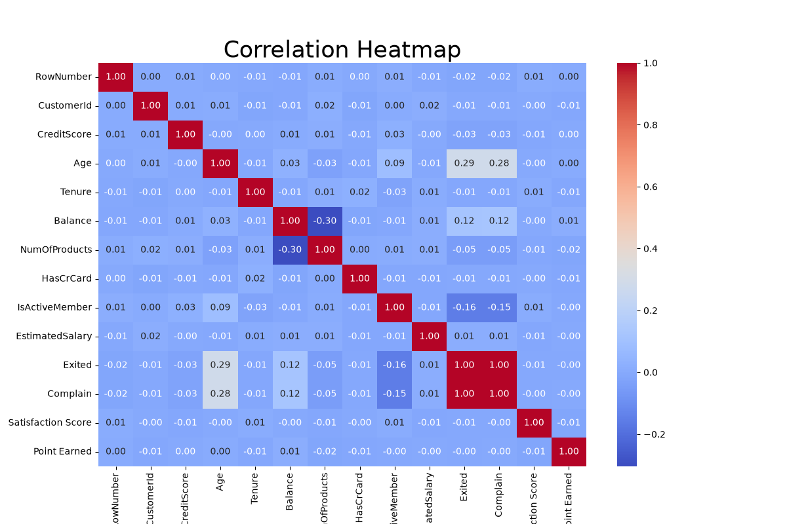

# 🏦 Bank Customer Churn Analysis

> Exploratory Data Analysis of bank customers to understand patterns associated with customer churn.

## 📌 Overview

This project analyzes bank customer data to identify patterns and factors associated with customers leaving the bank.

## 🛠️ Tools

- 🐍 Python
- 🐼 Pandas
- 📊 Matplotlib
- 🎨 Seaborn
- 📓 Jupyter Notebook

## 🔍 Analysis

- Data Exploration & Cleaning
- Customer Churn Analysis
- Exploratory Data Analysis
- Data Visualization
- Correlation Analysis
- Business Insights

## 💡 Key Insights

- 🇩🇪 Germany showed the highest churn rate.
- 👩 Female customers showed higher churn than male customers.
- 🎂 Older customers showed higher churn tendencies.
- 👥 Active members showed lower churn.
- 📢 Customer complaints showed a very strong association with churn.
- 💰 Exited customers had a higher median balance.
- 💳 Credit Score and Estimated Salary showed relatively weak relationships with churn.

## 📊 Visualizations

## 📊 Visualizations

### 🌍 Churn by Geography

### ⚥ Churn by Gender

### 🎂 Age Distribution by Churn Status

### 👥 Churn by Active Membership

### 🔥 Correlation Heatmap

## 📁 Project Files
-`Customer-Churn-Records.csv` — Dataset
- `bank_customer_churn_analysis.ipynb` — Complete analysis
- `images/` — Project visualizations

## 👩‍💻 Author

**Irsa Shakeel**

Aspiring Data Analyst | Python • Pandas • Data Visualization

⭐ First project in my Data Analytics journey.
